# Quiz_App_JAVA

• Developed a quiz application featuring an intuitive user interface and a comprehensive question database.. 
• Developed a robust admin panel for efficient management and customization of quiz content.

## Getting Started

https://github.com/shivam1raj5/Quiz_App_JAVA/assets/57479532/e4bcdd45-d364-4762-9b14-1212df84c551

## 📷 Previews

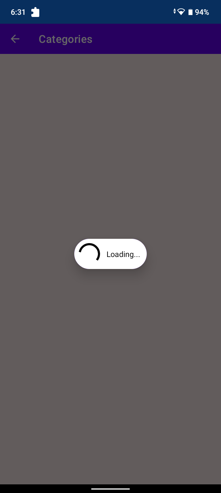
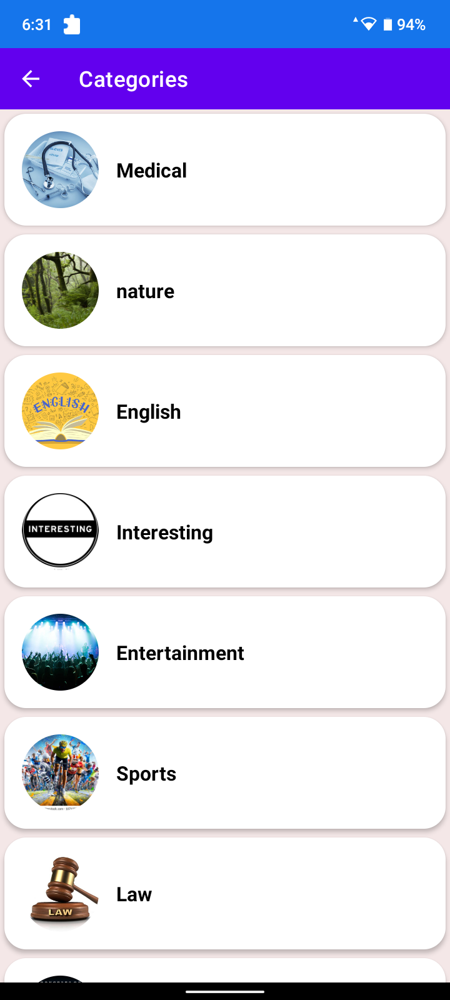
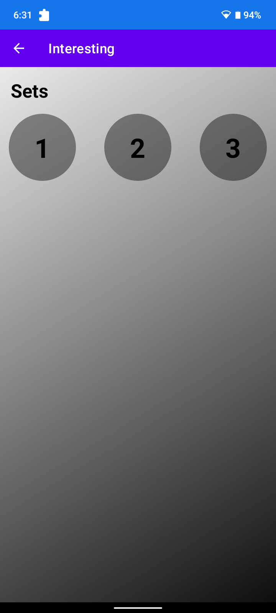
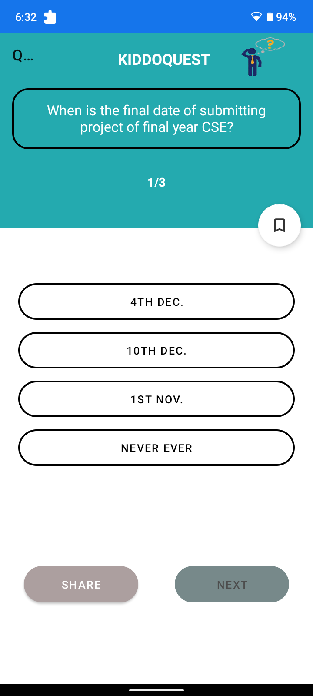

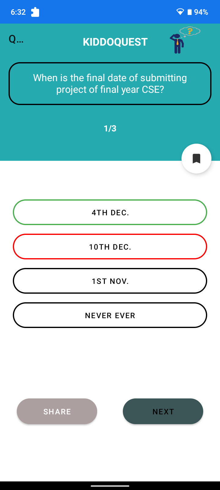
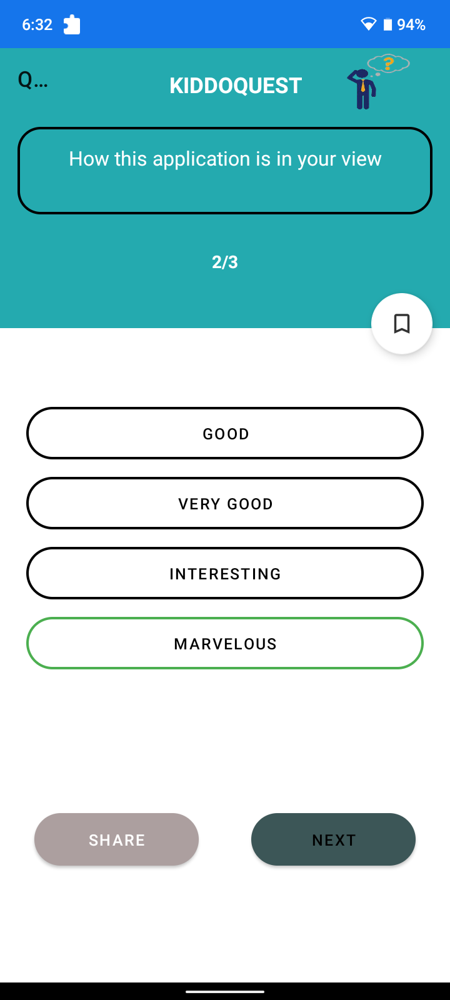

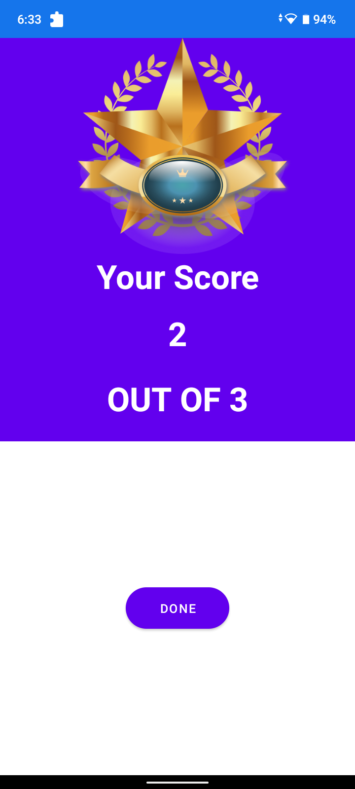
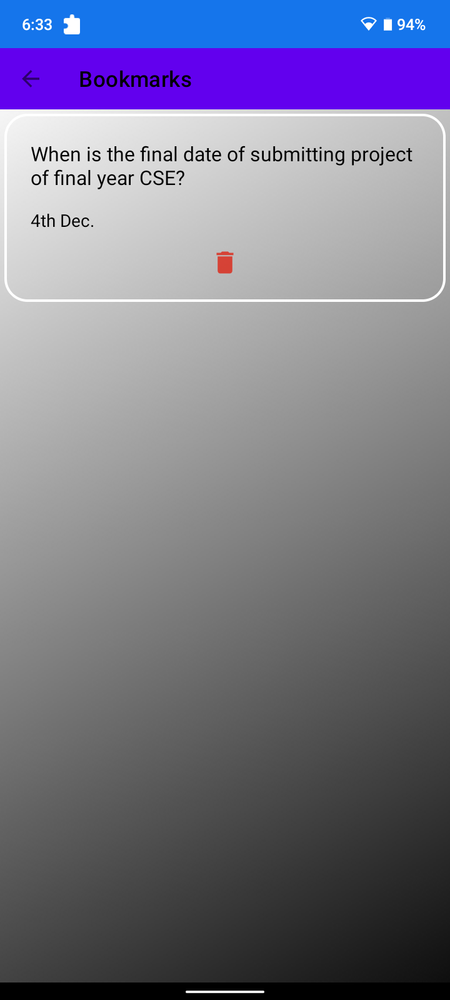

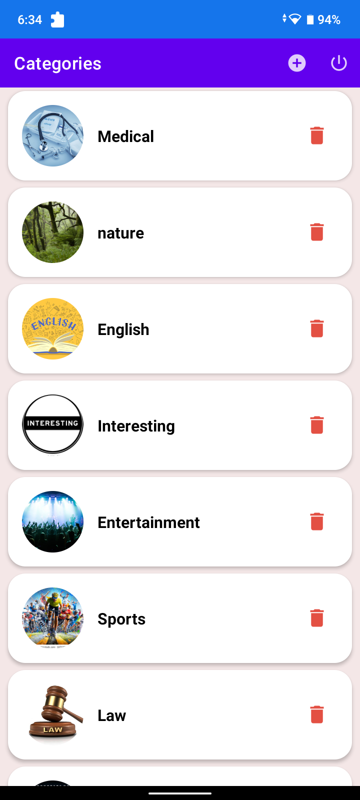
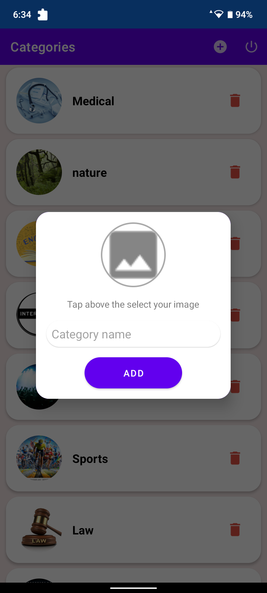
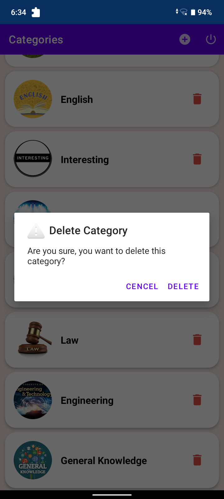
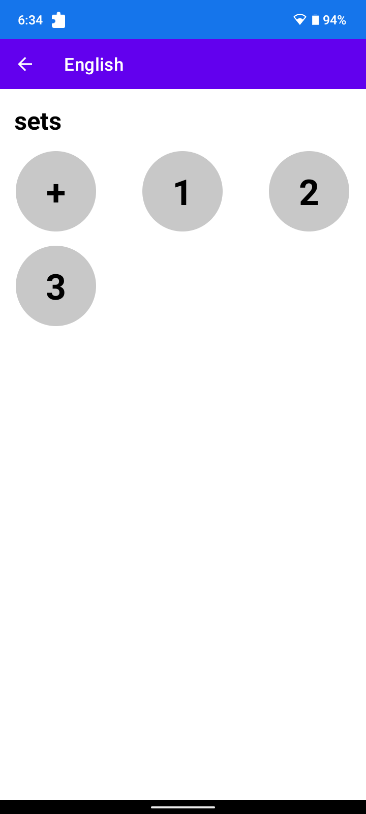
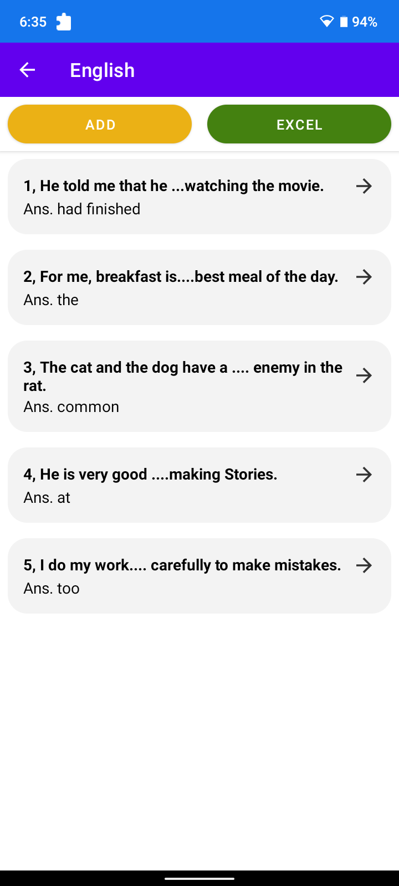
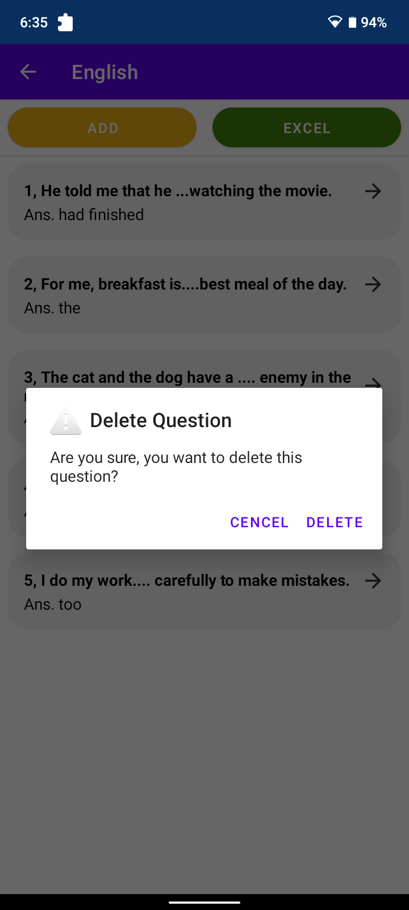
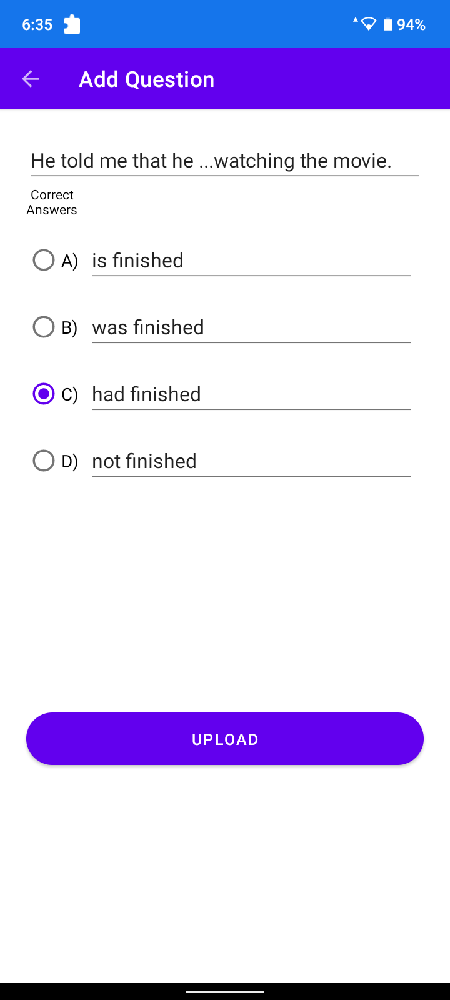
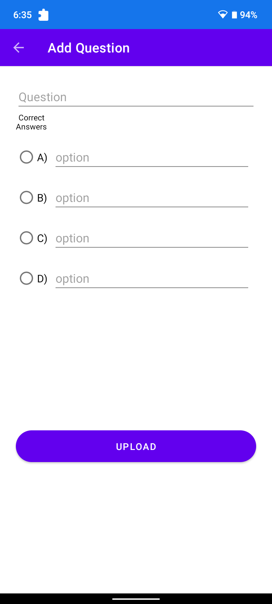

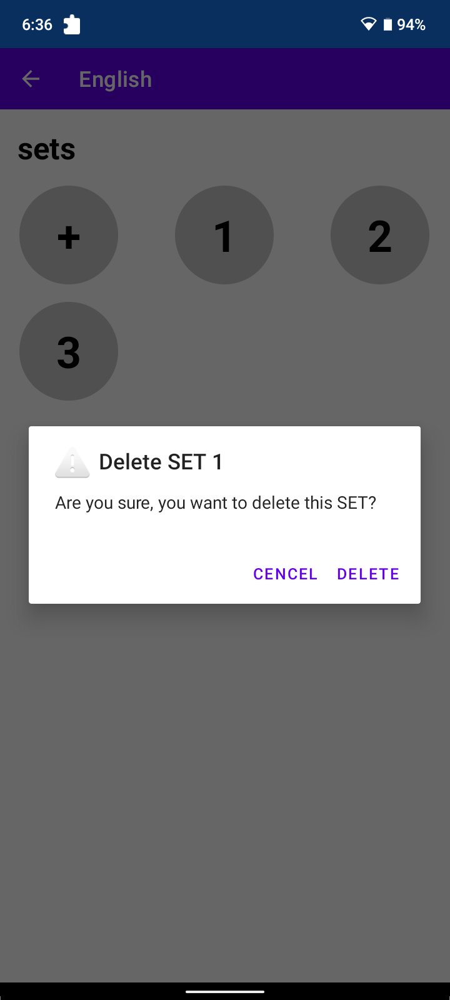
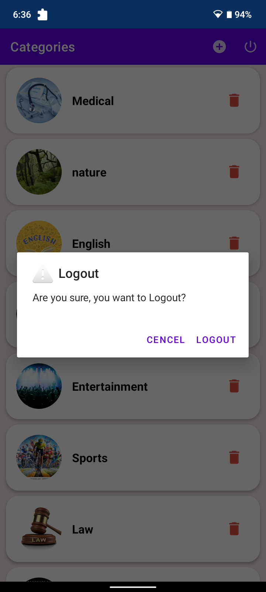

# Thank You
